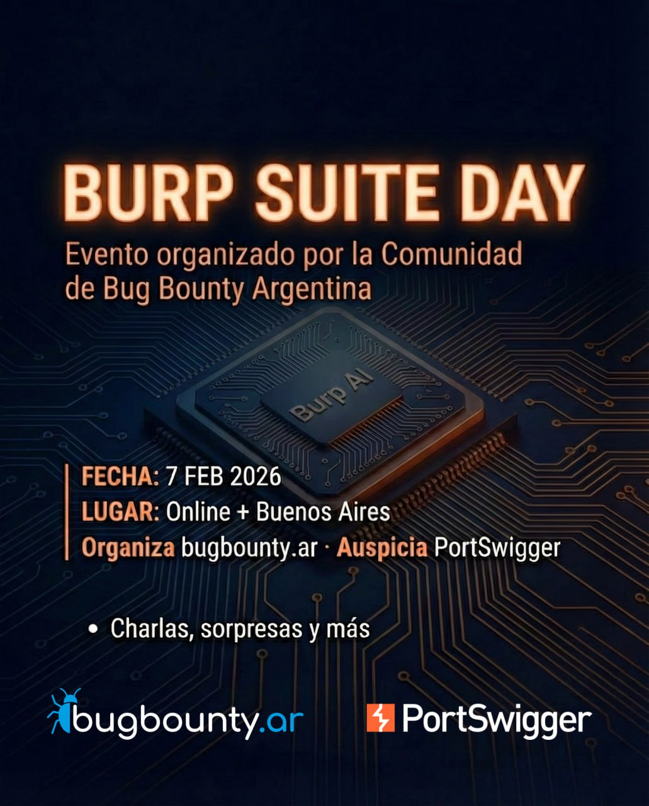

# Agentes y Skills con Burp Suite + MCP 🛡️🤖



Este repositorio contiene los materiales, configuraciones y la estructura de archivos necesaria para implementar el **Model Context Protocol (MCP)** en un flujo de trabajo de seguridad ofensiva, integrando **Burp Suite** con **VS Code** y **GitHub Copilot**.

Esta metodología fue presentada originalmente en el **Burp Suite Day**, evento organizado por la comunidad de **Bug Bounty Argentina (BugBounty.ar)**.

## 🎯 El Problema y la Solución

* **El Problema:** El pentester moderno pierde tiempo moviendo manualmente tráfico de Burp Suite a un chat de IA, perdiendo contexto en tiempo real y memoria del proyecto.
* **La Solución:** Utilizar MCP para que la IA pueda "ver" y "operar" Burp Suite directamente, utilizando agentes especializados y librerías de "skills" (conocimiento táctico).

---

## 📂 Estructura del Proyecto

> [!IMPORTANT]
> Es fundamental respetar la jerarquía de carpetas para que los agentes y el protocolo MCP puedan localizar los recursos correctamente.

```text
.
├── .github/
│   ├── agents/                   # Definiciones de perfiles de agentes
│   │   ├── burp-analyst.agent.md # Perfil experto en análisis de tráfico y detección de vulnerabilidades
│   │   ├── pentester.agent.md    # Perfil experto en reconocimiento activo
│   │   ├── reporter.agent.md     # Perfil experto en redacción de informes técnicos
│   │   └── web-crawler.agent.md  # Perfil experto en reconocimiento pasivo y mapeo de superficie
│   ├── skills/                   # Conocimiento táctico específico para cada tipo de auditoría
│   │   ├── information-disclosure-audit
│   │   │   ├── SKILL.md
│   │   └── security-headers-audit
│   │       └── SKILL.md
│   └── copilot-instructions.md   # Instrucciones sobre cómo interactuar con los agentes y el entorno MCP
├── mcp-proxy.jar                 # Proxy para la comunicación MCP
├── mcp.json                      # Configuración del servidor MCP
├── SCOPE.md                      # Definición del alcance del Pentest
├── PROGRESS.md                   # Bitácora de actividad y persistencia
├── TEMPLATE.md                   # Plantillas para reportes
└── INFORME.md                    # Resultado final de los hallazgos
```

## 🛠️ Requisitos Previos

Para replicar este entorno de trabajo, necesitarás:

* **VS Code:** Versión estable o Insiders (necesaria para las funciones más recientes de agentes).
* **GitHub Copilot:** Suscripción activa y extensión de *Copilot Chat* instalada.
* **Burp Suite:** Versión Professional o Community.
* **Java (JRE/JDK):** Necesario para ejecutar el servidor MCP de Burp Suite.
* **Node.js / npm:** Requerido para correr servidores MCP adicionales (como el de FileSystem).

---

## 🚀 Configuración e Instalación

### 1. Preparación de Burp Suite
Asegúrate de tener instalada la extensión oficial de **MCP Server** desde la BApp Store o configurada vía el archivo `.jar`.
Una vez descargada la extensión, descarga el archivo `mcp-proxy.jar` y colócalo en la raíz de tu proyecto.

### 2. Configuración del Servidor MCP
El archivo `mcp.json` es el corazón de la integración. Debes configurarlo en VS Code para habilitar las herramientas de Burp y el acceso al sistema de archivos:

```json
{
  "servers": {
    "burp": {
      "command": "/usr/bin/java",
      "args": [
        "-jar",
        "/home/user/burpsuite_day/mcp-proxy.jar", // Ruta al MCP .jar de Burp Suite
        "--sse-url",
        "http://127.0.0.1:9876"
      ]
    },
    "playwright": {
      "command": "npx",
      "args": [
        "@playwright/mcp@latest",
        "--proxy-server=http://127.0.0.1:8080" // Configura Playwright para usar el proxy de Burp Suite
      ],
      "type": "stdio"
    },
    "filesystem": {
      "command": "npx",
      "args": [
        "-y",
        "@modelcontextprotocol/server-filesystem",
        "/home/user/burpsuite_day" // Ruta al directorio raíz del proyecto para acceso a archivos
      ]
    }
  }
}
```
## 📚 Referencias y Recursos

* **Repositorio MCP-Lab:** [artssec/BurpSuite_con_MCP_y_VSCode](https://github.com/artssec/BurpSuite_con_MCP_y_VSCode)
* **MCP Burp Server:** [PortSwigger/mcp-server](https://github.com/PortSwigger/mcp-server)
* **Sitio Oficial MCP:** [modelcontextprotocol.io](https://modelcontextprotocol.io/)
* **Customizing VS Code con IA:** [Documentación oficial](https://code.visualstudio.com/docs/copilot/copilot-customization)

---

## 👤 Acerca del Autor

**Hugo Avila** - *Cybersecurity Consultant & Full Stack Developer* en **ArtsSec.com**.

* **LinkedIn:** [devhugoavila](https://linkedin.com/in/devhugoavila)
* **X (Twitter):** [@hugok2k](https://x.com/hugok2k)
* **Web:** [hugoavila.dev](https://hugoavila.dev)

---

## ⚖️ Descargo de Responsabilidad (Disclaimer)

El uso de estas herramientas con fines de ataque a infraestructuras sin autorización previa es ilegal. Este repositorio tiene fines exclusivamente educativos y de auditoría ética. El autor no se hace responsable del mal uso de esta información.